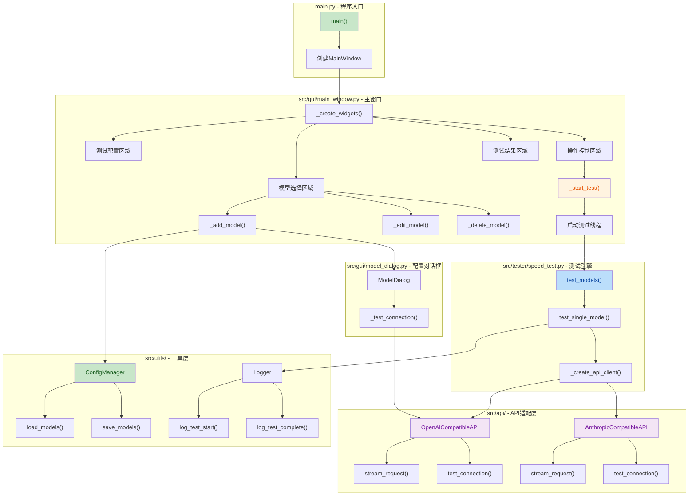
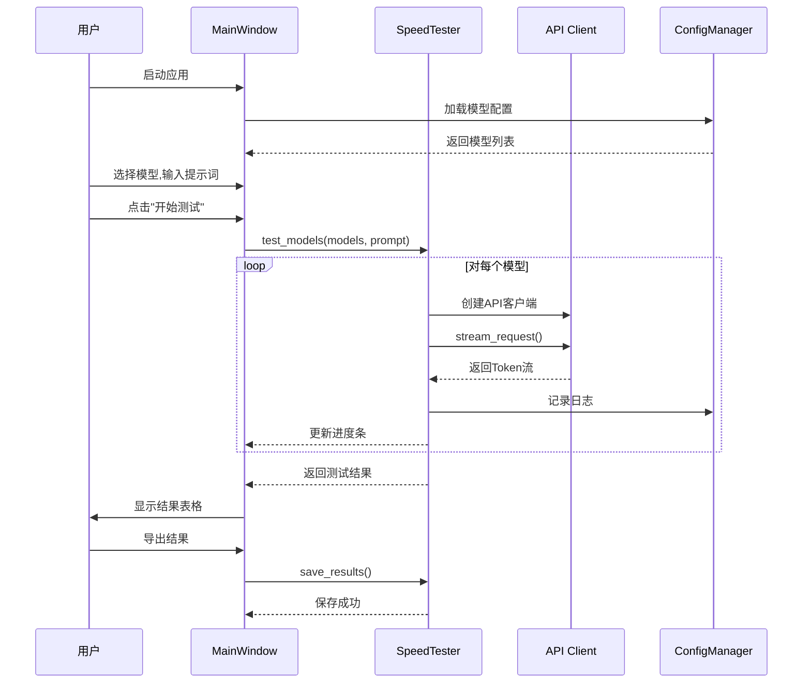

## 1. 项目介绍

AI模型速度测试工具

* **核心变更**:

  * ✅ 实现了基于tkinter的图形界面,支持模型管理、测试配置、结果展示

  * ✅ 支持OpenAI和Anthropic两种API协议的流式和非流式请求

  * ✅ 实现了首次Token响应时间和完整输出性能测试

  * ✅ 提供模型配置的增删改查功能,支持导入/导出

  * ✅ 完整的日志记录和测试结果导出(JSON/CSV)功能

***

## 2. 可视化概览 (代码与逻辑映射)



### 核心业务流程



***

## 3. 详细变更分析

### 3.1 📦 项目结构与配置

#### 新增文件结构

| 文件路径                   | 说明      | 关键内容                            |
| ---------------------- | ------- | ------------------------------- |
| `main.py`              | 程序入口    | 初始化tkinter根窗口和MainWindow        |
| `requirements.txt`     | 依赖声明    | requests>=2.28.0, httpx>=0.24.0 |
| `config/settings.json` | 默认配置    | 提示词、temperature、max\_tokens等    |
| `.gitignore`           | Git忽略规则 | 排除models.json和日志文件              |

#### 配置管理 (`src/utils/config.py`)

**功能**: 统一管理模型配置和程序设置

**核心方法**:

* `load_models()` / `save_models()`: 加载和保存模型配置,API密钥使用Base64加密

* `add_model()` / `update_model()` / `delete_model()`: 模型CRUD操作

* `export_models()` / `import_models()`: 配置导入导出

**默认模型列表**:

| 模型名称         | 协议     | 备注      |
| ------------ | ------ | ------- |
| qwen3.5-plus | OpenAI | 通义千问    |
| glm-5        | OpenAI | 智谱AI    |
| MiniMax-M2.5 | OpenAI | MiniMax |
| kimi-k2.5    | OpenAI | 月之暗面    |

***

### 3.2 🔌 API适配层

#### 基础抽象类 (`src/api/base.py`)

**设计模式**: 模板方法模式

**核心方法**:

```python
@abstractmethod
def test_connection() -> Tuple[bool, str]  # 测试连接
@abstractmethod
def stream_request(prompt, start_time) -> Generator  # 流式请求
@abstractmethod
def full_request(prompt) -> Tuple[str, float, int]  # 完整请求

def measure_first_token_time(prompt) -> Tuple[float, str]  # 测量首次Token时间
def measure_full_output(prompt) -> Dict  # 测量完整输出性能
```

#### OpenAI兼容实现 (`src/api/openai.py`)

**端点**: `{api_url}/chat/completions`

**请求头**:

```python
{
    "Authorization": f"Bearer {api_key}",
    "Content-Type": "application/json"
}
```

**流式响应解析**: 解析SSE格式,提取`choices[0].delta.content`

#### Anthropic兼容实现 (`src/api/anthropic.py`)

**端点**: `{api_url}/messages`

**请求头**:

```python
{
    "x-api-key": api_key,
    "anthropic-version": "2023-06-01",
    "Content-Type": "application/json"
}
```

**流式响应解析**: 解析`content_block_delta`事件,提取`delta.text`

***

### 3.3 🎨 GUI模块

#### 主窗口 (`src/gui/main_window.py`)

**窗口尺寸**: 900x850,最小尺寸900x850

**布局结构** (卡片式设计):

1. **模型选择区域**

   * 复选框列表显示所有模型

   * 操作按钮: 添加(绿)、编辑(橙)、删除(红)、导入/导出(蓝)

2. **测试配置区域**

   * 提示词输入框(Text组件,高度4行)

   * Temperature和Max Tokens并排输入

3. **操作控制区域**

   * 开始测试(绿)、停止测试(红)、导出结果(橙)

   * 进度条和进度标签

4. **测试结果区域**

   * Treeview表格显示结果

   * 列: 模型名称、状态、首次Token、总用时、Token数、速度

**关键交互**:

* `_start_test()`: 启动后台线程执行测试

* `_update_progress()`: 通过`root.after()`更新UI

* `_export_results()`: 支持JSON和CSV格式导出

#### 模型配置对话框 (`src/gui/model_dialog.py`)

**对话框尺寸**: 500x520,固定大小

**表单字段**:

* 模型名称 *(必填)*

* API接口地址 *(必填)*

* API密钥 *(必填,密码显示)*

* 接口协议: OpenAI兼容 / Anthropic兼容

* Temperature / Max Tokens

**功能**:

* 添加模式: 空表单

* 编辑模式: 下拉选择已有模型,自动填充表单

* 测试连接: 实时验证API配置

#### 自定义控件 (`src/gui/widgets.py`)

| 控件类                  | 功能                    |
| -------------------- | --------------------- |
| `StatusLabel`        | 带颜色的状态标签(成功/错误/警告/信息) |
| `ProgressFrame`      | 进度条+标签组合              |
| `ModelCheckboxFrame` | 模型复选框组                |

***

### 3.4 ⚡ 测试引擎 (`src/tester/speed_test.py`)

**核心类**: `SpeedTester`

**测试流程**:

```python
def test_models(models, prompt, progress_callback):
    for model in models:
        result = test_single_model(model, prompt)
        progress_callback(current, total, result)
```

**性能指标计算**:

* **首次Token时间**: 从请求发送到第一个Token到达的时间(秒)

* **总用时**: 完整响应时间(秒)

* **Token数量**: 估算值 = 字符数 ÷ 2 (中英文混合平均值)

* **生成速度**: Token数量 ÷ 总用时 (Token/秒)

**结果导出**:

* JSON格式: 包含时间戳、结果列表、统计摘要

* CSV格式: 中文表头,适合Excel查看

***

### 3.5 📝 日志系统 (`src/utils/logger.py`)

**日志文件位置**: `logs/log_YYYYMMDD.log`

**日志级别**: DEBUG/INFO/WARNING/ERROR

**专用日志方法**:

* `log_test_start()`: 记录测试开始

* `log_first_token()`: 记录首次Token响应时间

* `log_test_complete()`: 记录测试完成及性能指标

* `log_test_error()`: 记录测试失败

* `log_api_request()`: 记录API请求URL

***

### 3.6 📄 文档与原型

#### 需求文档 (`需求文档.md`)

**包含内容**:

* 项目概述与技术栈

* 详细功能需求(首次Token测试、完整输出测试、模型管理)

* 接口协议规范(OpenAI/Anthropic)

* 界面设计布局

* 数据存储方案

* 非功能需求(性能、安全、可用性)

* 项目结构说明

* 开发计划与验收标准

#### HTML原型 (`prototype.html`)

**功能**: 完整的UI原型,用于设计参考

**特性**:

* 响应式布局

* 渐变色标题栏

* 模态对话框(添加/编辑模型)

* 测试结果表格(带状态颜色)

* 进度条动画

* 统计卡片展示

***

## 4. 影响与风险评估

### 4.1 ⚠️ 破坏性变更

**无破坏性变更** - 这是一个全新项目,所有文件都是新增的。

### 4.2 🔒 安全考虑

| 安全项     | 实现方式                           | 评估             |
| ------- | ------------------------------ | -------------- |
| API密钥存储 | Base64加密存储在JSON文件中             | ⚠️ 弱加密,建议改用AES |
| 密钥传输    | HTTPS + Bearer Token/x-api-key | ✅ 安全           |
| 日志脱敏    | 不记录敏感信息                        | ✅ 安全           |
| 输入验证    | 表单字段必填验证                       | ✅ 基本验证         |

**建议改进**:

* 考虑使用`cryptography`库实现AES加密

* 添加API密钥掩码显示功能

### 4.3 🧪 测试建议

#### 功能测试场景

1. **模型管理**

   * 添加新模型并测试连接

   * 编辑现有模型配置

   * 删除模型并验证配置文件更新

   * 导入/导出配置文件

2. **速度测试**

   * 测试单个模型的首次Token响应时间

   * 测试多个模型的完整输出性能

   * 测试过程中点击"停止测试"

   * 测试网络异常情况(错误提示)

3. **结果导出**

   * 导出JSON格式并验证数据完整性

   * 导出CSV格式并用Excel打开验证

   * 无结果时点击导出(应提示警告)

#### 性能测试场景

1. 同时测试10+个模型,验证UI响应性
2. 长时间运行(1小时+),验证内存稳定性
3. 大量Token输出(5000+),验证速度计算准确性

#### 边界测试场景

1. 空提示词测试
2. 超长提示词测试(10000+字符)
3. 无效API密钥测试
4. 网络超时测试

***

## 5. 📊 项目统计

| 指标       | 数值      |
| -------- | ------- |
| 总文件数     | 22      |
| 代码行数     | \~2000+ |
| Python模块 | 8       |
| GUI组件    | 4个主要区域  |
| 支持的API协议 | 2种      |
| 默认预设模型   | 4个      |

***

## 6. ✅ 验收标准对照

根据需求文档的验收标准:

| 验收项                  | 状态 | 说明                             |
| -------------------- | -- | ------------------------------ |
| 测试首次Token响应时间        | ✅  | `measure_first_token_time()`实现 |
| 测试完整输出用时和速度          | ✅  | `measure_full_output()`实现      |
| 支持OpenAI和Anthropic协议 | ✅  | 两个独立的API实现类                    |
| 模型增删改查               | ✅  | ConfigManager完整实现              |
| 默认4个预设模型             | ✅  | `_get_default_models()`定义      |
| 界面流畅无卡顿              | ⏳  | 需实际运行测试                        |
| 测试结果准确               | ⏳  | 需与实际API对比验证                    |
| 界面简洁直观               | ✅  | 卡片式布局,色彩分明                     |
| 操作流程清晰               | ✅  | 从上到下的线性流程                      |
| 错误提示友好               | ✅  | 使用messagebox提示                 |
| 提供使用说明               | ✅  | 需求文档详细说明                       |

***

## 7. 🚀 后续优化建议

1. **性能优化**

   * 考虑使用`aiohttp`实现异步并发测试

   * 添加请求缓存机制

2. **功能增强**

   * 支持批量测试历史记录查看

   * 添加图表可视化(使用matplotlib)

   * 支持自定义测试脚本

3. **安全加固**

   * 使用AES替代Base64加密

   * 添加环境变量支持API密钥

4. **用户体验**

   * 添加暗色主题切换

   * 支持快捷键操作

   * 添加系统托盘图标
